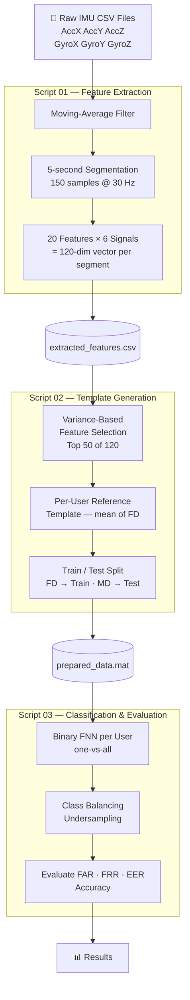

<div align="center">

# Multimodal Biometric Authentication via Motion Dynamics

**Authenticate users by the way they move — no passwords, no cameras, no fingerprints.**

[](https://www.mathworks.com/)
[](LICENSE)
[]()
[]()

</div>

---

## What is this?

This project implements a **transparent, continuous biometric authentication system** powered by motion dynamics — the subtle, individual patterns in how a person walks, holds, or interacts with their phone.

Using only a smartphone's **accelerometer** and **gyroscope**, the system:
- Extracts a rich 120-dimensional feature fingerprint from 5-second motion windows
- Builds a unique motion template per user from enrolment data
- Trains a dedicated **Feedforward Neural Network** to verify identity
- Reports industry-standard metrics: **FAR, FRR, and EER**

No biometric hardware. No camera. No special app. Just motion.

---

## Table of Contents

- [Pipeline](#pipeline)
- [Feature Engineering](#feature-engineering)
- [Dataset Format](#dataset-format)
- [Requirements](#requirements)
- [Usage](#usage)
- [Results](#results)
- [Project Structure](#project-structure)
- [Extending the System](#extending-the-system)
- [License](#license)

---

## Pipeline



---

## Feature Engineering

Each 5-second segment produces **120 features** (20 per signal × 6 signals).

### Signals
`AccX` · `AccY` · `AccZ` · `GyroX` · `GyroY` · `GyroZ`

### Features per Signal

| Domain | # | Feature |
|--------|---|---------|
| Time | 1 | Mean |
| Time | 2 | Standard deviation |
| Time | 3 | Variance |
| Time | 4 | RMS (Root Mean Square) |
| Time | 5 | Maximum |
| Time | 6 | Minimum |
| Time | 7 | Range (max − min) |
| Time | 8 | Median |
| Time | 9 | Mean absolute deviation |
| Time | 10 | Signal energy |
| Frequency | 11 | Spectral centroid |
| Frequency | 12 | Spectral spread |
| Frequency | 13 | Spectral energy |
| Frequency | 14 | Spectral entropy |
| Frequency | 15 | Peak FFT magnitude |
| Frequency | 16 | Mean FFT magnitude |
| Frequency | 17 | Std of FFT magnitude |
| Frequency | 18 | High-frequency component count |
| Frequency | 19 | Spectral crest factor |
| Frequency | 20 | Time-frequency product |

> Feature dimensionality is then reduced from **120 → 50** using variance ranking, cutting noise while preserving the most discriminative signal.

---

## Dataset Format

Files follow the naming convention `<UserID>NW_<Day>.csv`:

| Token | Values |
|-------|--------|
| `UserID` | `U1` … `U10` |
| `Day` | `FD` (enrolment session), `MD` (verification session) |

**Example:** `U1NW_FD.csv`, `U7NW_MD.csv`

Each row is one timestep with 7 columns:

```
Time | AccX | AccY | AccZ | GyroX | GyroY | GyroZ
```

Place all 20 CSV files (`10 users × 2 days`) in the MATLAB working directory before running.

---

## Requirements

| Dependency | Version |
|-----------|---------|
| MATLAB | R2019b or later |
| Deep Learning Toolbox | Required for `feedforwardnet` |
| Statistics Toolbox | Optional (for SVM extension) |

---

## Usage

Run the three scripts **in order**:

```matlab
% Stage 1 — extract motion features from raw sensor data
run('script_01_main_feature_extraction.m')

% Stage 2 — build per-user templates and prepare train/test sets
run('script_02_main_template_generation.m')

% Stage 3 — train neural networks and evaluate biometric performance
run('script_03_main_classification_evaluation.m')
```

Each script prints a detailed console summary and saves its outputs automatically.

---

## Results

The system outputs per-user and overall biometric performance metrics:

| Metric | Description | Target |
|--------|-------------|--------|
| **FAR** | False Acceptance Rate — impostors accepted | < 5% |
| **FRR** | False Rejection Rate — genuine users rejected | < 5% |
| **EER** | Equal Error Rate — where FAR equals FRR | < 5% |
| **Accuracy** | Overall correct authentication decisions | > 95% |

**Sample output table from Script 03:**

```
DETAILED RESULTS FOR ALL USERS
User  Username  TrainSamples  TP  TN  FP  FN  FAR     FRR     EER     Accuracy
----  --------  -----------  --  --  --  --  ------  ------  ------  --------
1     U1        12            8   71   3   1  0.0408  0.1111  0.0760  0.9474
2     U2        11            9   68   5   2  0.0685  0.1818  0.1252  0.9118
...
```

> The decision threshold (default `0.5`) can be tuned to trade FAR against FRR for the target use case.

---

## Project Structure

```
.
├── script_01_main_feature_extraction.m      # Stage 1 — signal processing & feature extraction
├── script_02_main_template_generation.m     # Stage 2 — template building & data preparation
├── script_03_main_classification_evaluation.m  # Stage 3 — FNN training & metric evaluation
├── LICENSE
└── README.md

# Generated (excluded from repo via .gitignore)
├── extracted_features.csv
├── user_features/
│   ├── U1_features.csv
│   └── ...
├── prepared_data.mat
├── user_reference_templates.mat
└── classification_results.mat
```

---

## Extending the System

| Idea | How |
|------|-----|
| **Add SVM classifier** | Replace `feedforwardnet` with `fitcsvm` for a direct FNN vs. SVM comparison |
| **ROC curve analysis** | Sweep the decision threshold to plot and compare operating points |
| **Continuous authentication** | Apply a sliding window instead of isolated segments |
| **Additional sensors** | Add magnetometer or barometer channels as extra signals in Script 01 |
| **Temporal drift study** | Add a third recording session to measure performance degradation over time |
| **Deep learning** | Replace the shallow FNN with an LSTM over raw signal sequences |

---

## License

Released under the [MIT License](LICENSE). Free to use, modify, and distribute with attribution.

---

<div align="center">

*Built with MATLAB · Accelerometer + Gyroscope · Motion as Identity*

</div>
